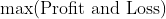
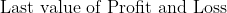

# group_01_project

This is the base git project for group 01 of IE498 HFT in Spring 2022.

## Teammates

Yihong Jian - yihongj2@illinois.edu (Team Leader)

Ruipeng Han - ruipeng2@illinois.edu

Zihan zhou - zihanz12@illinois.edu

Tomoyoshi (Tommy) Kimura - tkimura4@illinois.edu

## Environment

Standard development environment is provided using vagrant box.

### Software included
- Strategy Studio
- Python 3.7.11
  - Additional Packages should be included in ```requirements.txt```.

Please create a issue for additional softwares so that we can put it in vagrant provisioning.

### Usage:

1. Install Vagrant and virtualbox.
2. Download box using this [link](https://uofi.box.com/s/wlyq6b23k41dbw1bz7sfff631osp1049) that requires login from your university account.
3. Set directory of box file to environment variable ```SS_BOX```, for example:
    ```   bash
    export SS_BOX="/home/user/IE498hftGroup1.box
4. Set directory of strategy studio ```SS_LICENSE```, for example:
    ```   bash
    export SS_LICENSE="/home/user/license.txt
5. ``` bash
   vagrant up
6. Then use ```vagrant ssh``` to connect to VM

## Project structure

### Market Data Parsers

All the data parser (Nasdaq/IEX/alpaca) should be placed under ```parser``` folder. 

Implementation should follow the interface in ```parser_base.py```.

Please download all the dependencies with

```bash
pip3 install -r requirements.txt
```

#### Investor Exchange (IEX)

##### IEX Description

- We directly imported Professor's IEX downloader/parser as a submodule of our project so we can conveniently retrive IEX data.
- This parser downloads and parses IEX DEEP and trade data into the "Depth Update By Price" and "Trade Message" format in Strategy Studio, respectively. 
- The original repository can be found <ins>[here](https://gitlab.engr.illinois.edu/shared_code/iexdownloaderparser)</ins>.

##### IEX Usage

1. Direct to the IexDownloaderParser directory `cd parser/IexDownloaderParser`and run <code>./download.sh</code> to download the source IEX deep data (.gz format). To retrieve data in a specific range of dates, open and edit the download.sh, only modifies the start-date and end-date arguments:

   ```bash
   python3 src/download_iex_pcaps.py --start-date 2021-11-15 --end-date 2021-11-16 --download-dir data/iex_downloads
   ```

   Note that git-submodules need to be pulled separately, detailed instruction for pulling git-submodule can be found [here](https://stackoverflow.com/questions/1030169/easy-way-to-pull-latest-of-all-git-submodules)

2. Check that the downloaded raw IEX DEEP dat files should be stored at `iexdownloaderparsers/data/iex_downlaods/DEEP`

3. Run `./parse_all.sh` to parse IEX deep data. Result will be stored under `iexdownloaderparsers/data/text_tick_data` with the foramt `tick_SYMBOL_YYYYMMDD.txt.gz`.  

   To specify the company symbols, edit the `--symbols` argument in `parse_all.sh`. The default is SPY only. You can add more companys:

   ```bash
   gunzip -d -c $pcap | tcpdump -r - -w - -s 0 | $PYTHON_INTERP src/parse_iex_pcap.py /dev/stdin --symbols SPY,APPL,GOOG,QQQ --trade-date $pcap_date --output-deep-books-too
   ```

4. The parsed data is in `.gz` format. We want to extract it and save it to a `.txt` file which can be feed into Strategy Studio. Run the following command under `iexdownloaderparsers/data/text_tick_data`  ***(please change your symbol and dates accordingly)***:

   ```bash
   gunzip -d -c tick_SPY_20171218.txt.gz | awk -F',' '$4 == "P" {print $0}' > tick_SPY_20171218.txt
   ```

   This command extracts the data and rows where the fourth column is "P", which corresponds to the format of "Depth Update By Price (OrderBook data)" in Strategy Studio. 

   If instead you want to retrive only the trade data, simply change "P" to "T" in the above command, which is following:

   ```bash
   gunzip -d -c tick_SPY_20171218.txt.gz | awk -F',' '$4 == "T" {print $0}' > tick_SPY_20171218.txt
   ```

5. The `tick_SPY_20171218.txt` (*or your custom data file*) is ready to feed in SS.

#### NASDAQ

##### NASDAQ Description

- We implemented a NASDAQ TotalView-ITCH 5.0 parser in C. We have implemented the parser according to the rules and requirements of NASDAQ TotalView-ITCH 5.0 [speicifcation](https://www.nasdaqtrader.com/content/technicalsupport/specifications/dataproducts/NQTVITCHspecification.pdf); specifically, we used we use the bswap macros to do the conversion from binary/raw data to texts. The data-decoding part is tedious and non-trivial; with limited time and less usage on order book data, we only implemented the parse to parse only traded data from NASDAQ among a total 23 supported message types.
- For ease of use, we included a makefile in the parse directory so users can simply make and run.

##### NASDAQ Usage

1. Direct to the `nasdaq_parser` directory (`cd parser/nasdaq_parser`) in where the makefile is located, and run <code>make</code>.
   This should generate an executable of the parser named `nasdaq_parser`.

2. Run the nasdaq_parser with the following arguments:

   ```bash
   ./nasdaq_parser [input_file_path] [output_folder_path] [Message type = T]
   ```

   Please notice that current Nasdaq parser can only parse trade data, so the last argument should be set to T.

3. The parsed trade message will be outputed to the specified directory in the format of csv. These files are ready to be used by Strategy Studio for backtesting.

#### ALPACA

### Strategies

#### Strategy Directory

```bash
group_01_project
├── ...
├── ...
├── strategy
│	├── ArbStrategy
│		├── ArbStrategy.cpp
│		├── ArbStrategy.h
│	├── BLSFStrategy
│		├── BLSFStrategy.cpp
│		├── BLSFStrategy.h 
│	├── MeanReversionStrategy
│		├── MeanReversionStrategy.cpp
│		├── MeanReversionStrategy.h
│	├── SwingStrategy
│		├── SwingStrategy.cpp
│		├── SwingStrategy.h
│		└── ArbStrategy.h
│	└── compile_and_backtest.sh
├── ...
```

#### Strategy Description

We have four strategies implemented: Arbitage Strategy, Buy Last Sell First, Mean Reversion Strategy, and Swing Strategy.

##### ArbStrategy

- This is a trading strategy that traces two market ticks and condust statistical measurements on the past tick data to determine whether to buy or sell the next data of one of the tick symbol. 

##### BLSF Strategy

- This is a trading strategy that buys at the end of the day, and sell in the beginning of a day if it is profitable. 

##### MeanReversionStrategy

- This is a trading strategy that keeps track of the previous price and determine whether to buy or sell by comparing the current price with the previous mean (reversion). 

##### SwingStrategy

- This is a trading strategy that assumes the market price would fall after buying/selling at the maximum/minimum swing of the market. 

#### Strategy Usage

- Move these files (`.cpp, .h, Makefile`) into Strategy Studios
- We have provided the script file `compile_backtest.sh` that compiles the strategy, moves the strategy output file to the desired location in Strategy Studio, and start the backtest command line in Strategy Studio. 
- When Strategy Studio finishes backtesting, our script would then export these files into `.csv` files. 

### Analysis & Visualization

```
group_01_project
├── ...
├── ...
├── strategy
│	├── compare_strategy.py
│	├── main.py
│	├── strategy_analysis.py
├── ...

```

#### Analysis

##### Analysis & Visualization Description

- For analysis, we would like to know the statistics of our strategy. There are various metrics that we would like to evaluate on our result. Strategy Studio outputs three files: fills, orders, and PnL (Profit and Loss). For analysis, we would mainly focus on PnL since the net loss is what we care about the most as traders.

- The PnL file generated is a `.csv` file with three columns: Strategy name, Time, and Cumulative PnL. For interpretation, we would analyze the PnL based on several metrics. 

  - Maximum Profit and Loss

    

  - Minimum Profit and Loss

    

  - Net Profit and Loss

    

  - Cumulative Returns

    

  - Sharpe Ratio

    

  - Max Drowndown

    


- For visualization, we would like to visualize the Profit and Loss against Time, as well as a comparison with the Tick data.

##### Analysis & Visualization Usage

- Direct to `analysis` directory (`cd ./analysis`)
- Simply run `python3 main.py` would run visualization by using the latest three files (Fill, Order, and PnL). This will generate figures and store in `./figs/` directory. 
- There is also an interactive version by runing `python3 main.py -i` and follows the promot.
  - Interactive mode would ask you to add strategy by entering the 
    - `Name` of the strategy
    - `ID` of the strategy output if the strategy is ran multiple times
    - `Ticks` of the strategy, or the symbol, for example:`SPY` 
  - When we enter no for adding strategy, the interactive mode would also outputs the **measurement table** with each strategy statistics as a column

### Quality assurance
- **Code Sanity**
  - Python code will be checked by ```PyLint``` under PEP8 standard.
  - C++ files will be checked by `cpplint` under Googel CPP standard

## Reference

Nasdaq offcial guide on TotalView-ITCH 5.0 data: https://www.nasdaqtrader.com/content/technicalsupport/specifications/dataproducts/NQTVITCHspecification.pdf