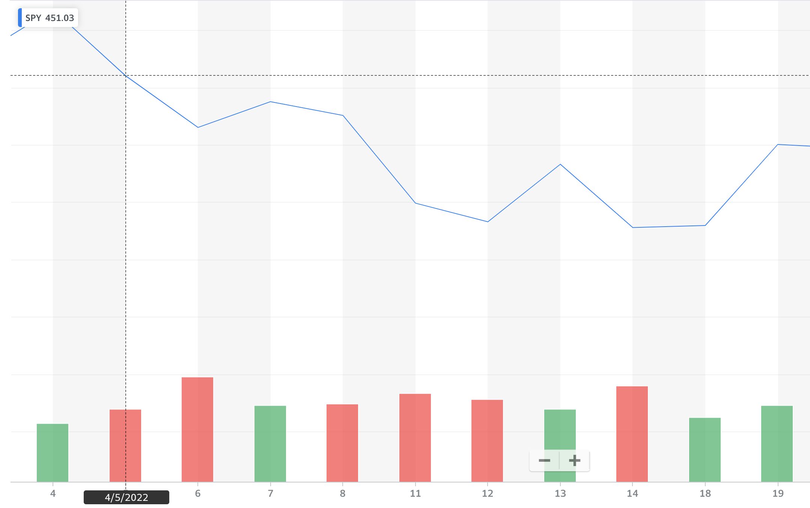
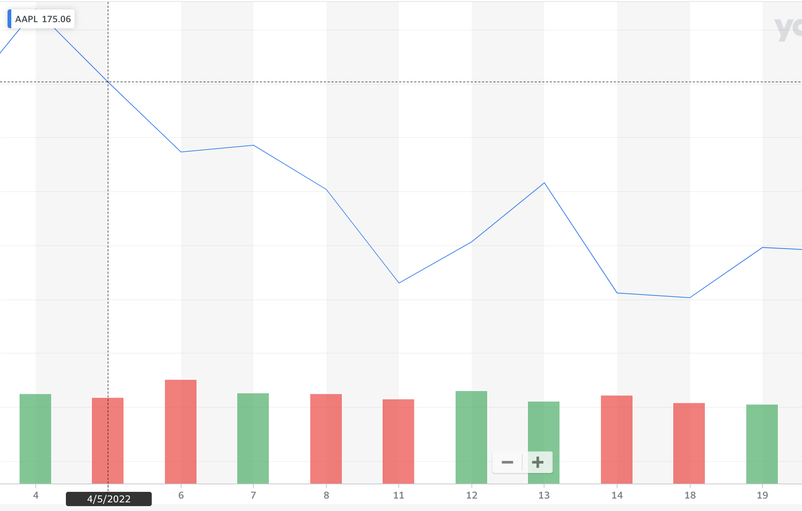
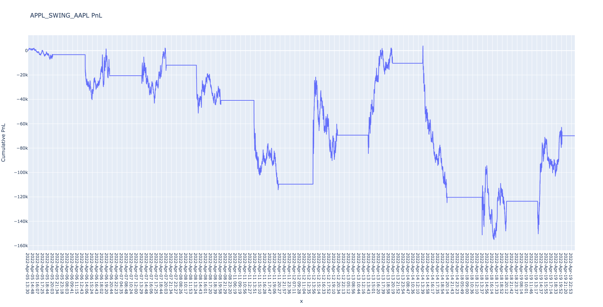
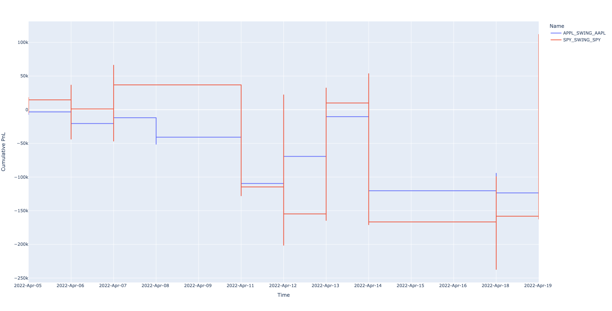
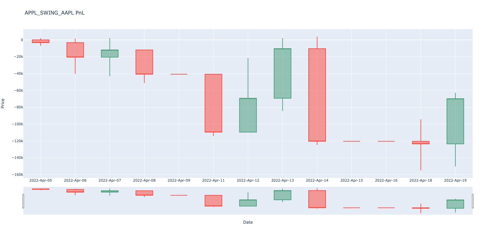
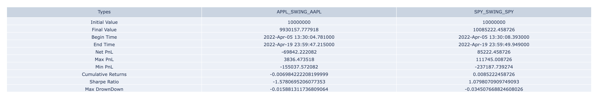

# Group 1 IE 498 High Frequency Trading Final Report

Authors: Tommy Kimura, Yihong Jian, Ruipeng Han, Zihan Zhou

[TOC]

## Introduction

### Background

Strategy Studio is a proprietary software from RCM used for trading strategy developement and testing. However, the software is hard to use due to numerous reasons. For instance, the software does not provide any built in data, so users have to collect and handle high frequency data on their own. Also, running the software would launch another terminal, making the already complicated C++ CLI development even harder. Therefore, our final project aims to streamline this process. 

### Overview

For our final project, we developed a High Frequencey Trading strategy pipeline containing three major components: data, strategy, and analysis. For data, we implemented data aquisions and parsing script for SIP data from Alpaca, and data parsing script for NASDAQ ITCH. For strategy part, we implemented four distinct strategies using Strategy Studio(SS). For the analysis part, we implemented interpretation and visualization script for SS backtesting output. In addition, we also packaged vagrant boxes for automated backtesting and set up GitLab CI/CD for code quality assurance.

## Project Structure

### DevOps

#### CI/CD

To ensure the codes are readable and functions properly, we set up an automatic GitLab CI/CD pipeline that runs whenever a pull request to main is opened. The runner rests on Azure VM and runs code linting/compiling. Python codes are checked against PEP8 standard and C/C++ code are checked against Google style. We also used strict compiling flags ```-Werror -Wextra -Wall``` to detect errors during compile time.

#### Vagrant

We repackaged Prof's FIN566 VM to include a built in Python 3.7 that provides access to additional dependencies requiring Python > 3.6. We also included automatic setup and job running script in the Vagrant file, so all the tasks can be done with one click.

### Data parsers

#### Data Sources

##### IEX

##### NASDAQ

##### Alpaca

#### Parser implementation

#### Strategy Studio Data Feeds

Strategy Studio offers a great tool for data feed – text tick reader. This allows Strategy Studio to facilitates automated strategy regression testing against pre-canned data scenarios involving common tick types. In this project, we will store these pre-canned data with the specifed naming convention `tick_SYMBOL_YYYYMMDD.txt`. The text reader supports various event types and fields: 

1. **Trades**
2. **Quotes (Best Bid Offer)**
3. **Depth Update By Order (OrderBook data)**
4. **Depth Update By Price (OrderBook data)**
5. **Order Book Reset**
6. **Imbalance**

For this project, we would mainly focus on two specfic events: **Trades** and **Quotes (BBO)**. 

##### Trades

##### Quotes (BBO)

------

### Strategy Implementation

#### Arb Strategy

#### Buy Last Sell First Strategy

##### Description

- This strategy is an introductory strategy that we implemented to understand the Strategy Studio interface. The basic pipeline is that we are buying at the end of the day, right before the market closes. Then, we would sell when the market opens. 

##### Results

- Results

#### Mean Reversion Strategy

##### Description

- The mean reversion trading strategy involves betting that prices will revert back towards the mean or average (of historical trades of size n, where n is tunable hyperparameter). Markets are forever moving in and out of phases of mean reversion and momentum. Therefore it’s possible to develop strategies for both types of market. A simplistic example of a mean reversion strategy is to buy a stock after it has had a large fall in price. When a stock has seen a big drop, there’s usually a good chance that it will bounce back to a more normal level.

- Currently, we have set the sample size to 1000 (i.e calculating the mean of last 1000 trades).

##### Result

#### Swing Strategy

##### Description

- This was a strategy described on CMC Market website. This strategy utilizes a structure of Swing to make decisions to trade. We could draw a swing in the real world as an analogy. When we are swinging, there is often a high point, and this would be the highest point we could reach. After this point, the swing would go back down to its lowest. Once it reaches its lowest point, the swing would then go back up to another point that is about the same as the previous high point, and so on. During this process, the swing could potentially go beyond the previous high points, with some extra mystery force, and this higher point could drive us to many different points. We use this analogy to describe the market, where we assume that the market price would fall after we reach the highest point, and vice versa. 
- To decide whether the market has reached its highest point, we are using Momentum to determine the overall trend of the recent market price. If the overall trend aligns with our previous trend, we know that we are still rising. However, if the momentum trend is completely different from our previous trend, we know that there is a big corner for recent trades, and we would then buy/sell accordingly to indicate a swing point. The swing points are updated by the local maximum and local minimum the interval has obtained to make sure that the Swing interval is changing based on the market flow to maintain the consistency. 

##### Results

###### Market Price (Yahoo Finance)





###### Real Time Analysis

- SPY
- APPLE (APPL)
  

- Together
  

###### Daily Bar Graph

- SPY
  
- APPLE (APPL)
  

###### Measurement Table



##### Analysis

We have run the strategy for two different tickers, SPY and Apple from April 5th to April 19th. We use the analysis component we wrote for analysis. 

------

### Interpretation & Visualization

#### Interpretation

- There are various metrics that we would like to evaluate on our result. Strategy Studio outputs three files: fills, orders, and PnL (Profit and Loss). For analysis, we would mainly focus on PnL since the net loss is what we care about the most as traders. 

- The PnL file generated is a `.csv` file with three columns: Strategy name, Time, and Cumulative PnL. For interpretation, we would analyze the PnL based on several metrics

  - Maximum Profit and Loss

    

  - Minimum Profit and Loss

    

  - Net Profit and Loss

    

  - Cumulative Returns

    

  - Sharpe Ratio

    

  - Max Drowndown

    

#### Visualization

- For visualization, we are using the Python package `plotly` to generate various meaningful graphs for evaluation. `plotly` offers powerful interactive figures for users to modify directly. Just like a few of the examples in the previous sections, we could see that there are various types like line, bar, and table like figures that simulates stock market graphs in real finance applications like Yahoo Finance. 

##### Implementation

There are mainly two classes: `StrategyAnalysis` and `CompareStrategy` . 

###### Strategy Analysis

- This class represents a Strategy object. This type of object is initialized with the three files generated from the Strategy Studio and it would use Pandas Dataframe to store each fill, order, and PnL. 

------

## Conclusion

## Reference

1. https://www.cmcmarkets.com/en/trading-guides/trading-strategies
2. https://optionalpha.com/help/backtesting-results-summary
3. https://blog.quantinsti.com/backtesting/
4. https://blog.quantinsti.com/stock-market-data-analysis-python/
5. 

