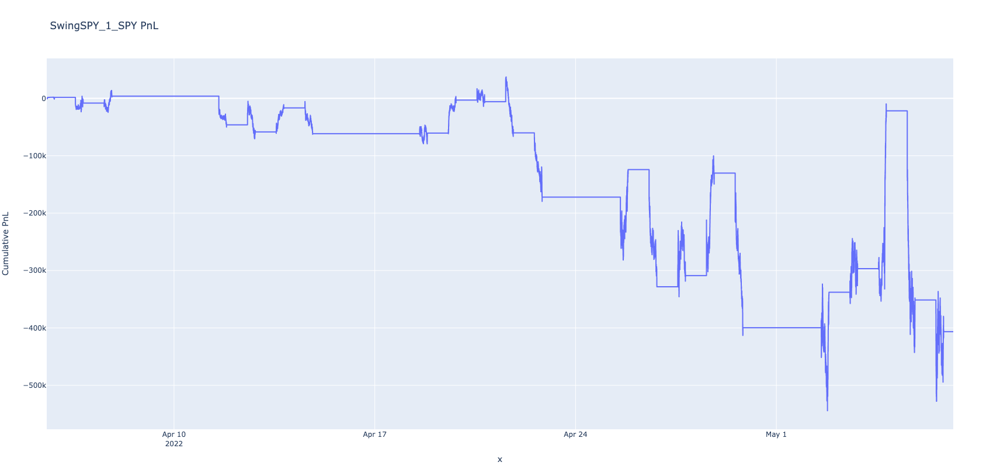

# Group 1 IE 498 High Frequency Trading Final Report

Authors: Tommy Kimura, Yihong Jian, Ruipeng Han, Zihan Zhou

[TOC]

## Introduction

### Background

Strategy Studio is a proprietary software from RCM used for trading strategy developement and testing. However, the software is hard to use due to numerous reasons. For instance, the software does not provide any built in data, so users have to collect and handle high frequency data on their own. Also, running the software would launch another terminal, making the already complicated C++ CLI development even harder. Therefore, our final project aims to streamline this process. 

### Overview

For our final project, we developed a High Frequencey Trading strategy pipeline containing three major components: data, strategy, and analysis. For data, we implemented data aquisions and parsing script for SIP data from Alpaca, and data parsing script for NASDAQ ITCH. For strategy part, we implemented four distinct strategies using Strategy Studio(SS). For the analysis part, we implemented interpretation and visualization script for SS backtesting output. In addition, we also packaged vagrant boxes for automated backtesting and set up GitLab CI/CD for code quality assurance.

## Project Structure

### DevOps

#### CI/CD

To ensure the codes are readable and functions properly, we set up an automatic GitLab CI/CD pipeline that runs whenever a pull request to main is opened. The runner rests on Azure VM and runs code linting/compiling. Python codes are checked against PEP8 standard and C/C++ code are checked against Google style. We also used strict compiling flags ```-Werror -Wextra -Wall``` to detect errors during compile time.

#### Vagrant

We repackaged Prof's FIN566 VM to include a built in Python 3.7 that provides access to additional dependencies requiring Python > 3.6. We also included automatic setup and job running script in the Vagrant file, so all the tasks can be done with one click.

### Data parsers

#### Data Sources

##### IEX

We directly imported the Professor's IEX downloader/parser as a submodule of our project so we can directly use it to download DEEP and TRADE data from IEX exchange that is ready to be feed into Strategy Studio for strategy development and backtesting. The link to Professor's IEX downloader/parser is [here](https://gitlab.engr.illinois.edu/shared_code/iexdownloaderparser). Details on directions of using the IEX downloader/parser can be found on the README.md under the project root directory.

##### NASDAQ

Our NASDAQ parser (specifically, parser for NASDAQ TotalView-ITCH 5.0) is implemented in C.
We have implemented the parser according to the rules and requirements of NASDAQ TotalView-ITCH 5.0 [speicifcation](https://www.nasdaqtrader.com/content/technicalsupport/specifications/dataproducts/NQTVITCHspecification.pdf); specifically, we used we use the bswap macros to do the conversion from binary/raw data to texts.

Performance: The time to parse a 3G gz raw file is roughly two minutes.

Details on directions of using the NASDAQ can be found on the README.md under the project root directory.

##### Alpaca

The Alpaca parser is implemented in python, with two utitlity endpoints consists of `get_trade` and `get_quote` functions.
Alpaca parser is built with the help of sdk provided by alpaca [specification](https://pypi.org/project/alpaca-trade-api/) and [instruction](https://alpaca.markets/docs/market-data/) , and it requires dependency of `alpaca-trade-api` library; specifically, run command `python3.7 /home/vagrant/Desktop/alpaca_parser.py tick_name startdate_yyyymmdd enddate_yyyymmdd --mode=T --output='/home/vagrant/Desktop/strategy_studio/backtesting/text_tick_data'` would download `tick_name` trade data start form `startdate` to `enddate` by calling aplaca historical data api. Altenatively, running with `-mode=Q` would download accodingly `quote` data. More specific instructions can be found in `download_from_alpaca.sh` in parser folder. In our project, we are using `trade` data to built order book in strategy_studio, since alpaca quote data is initialized to be NBBO involved two trade_center, but strategy_studio only accept quote data from one trade_center.

#### Strategy Studio Data Feeds

Strategy Studio offers a great tool for data feed – text tick reader. This allows Strategy Studio to facilitates automated strategy regression testing against pre-canned data scenarios involving common tick types. In this project, we will store these pre-canned data with the specifed naming convention `tick_SYMBOL_YYYYMMDD.txt`. The text reader supports various event types and fields: 

1. **Trades**
2. **Quotes (Best Bid Offer)**
3. **Depth Update By Order (OrderBook data)**
4. **Depth Update By Price (OrderBook data)**
5. **Order Book Reset**
6. **Imbalance**

For this project, we would mainly focus on two specfic events: **Trades** and **Quotes (BBO)**. 

##### Trades

- Trade data can reveal general trends in world trade, and Strategy Studio provide registration for Trades (and quotes), and we could use the trade data to feed our strategy to test the performance. To sue Trade data, we often implement the function `onTrade` which is called everytime the tick-reader has detected a trade tick. Then, we would use the passed in TradeEventMessage to update our variables, and then decide whether or not we would like to send an order to buy or sell. 

##### Quotes (BBO)

- Quotes, BBO, or Best Bid & Offer provides us the best bid/ask price in the current market. Unlike Trade data, for which the function `onTrade` is specifically called, `onQuote` does not behave the same and is only called when the best new data is updated. In this case, we use the function `onBar` to reach our goal. For strategy studio, on bar allow us to access the tick information within a short amount of period (bar). Everytime, we could access these information to make a trade. 

------

### Strategy Implementation

#### Arb Strategy

##### Description

##### Results

#### Buy Last Sell First Strategy

##### Description

- This strategy is an introductory strategy that we implemented to understand the Strategy Studio interface. The basic pipeline is that we are buying at the end of the day, right before the market closes. Then, we would sell when the market opens. This was recommended by the Professor of the course to start off with, and we have modified a few aspects to make the algorithm more robust to extreme market cases. 
- The central belief of the algorithm is that the market price would raise during the closure of the market at night, and therefore buying before the closure and selling right after could theoretically give us a profit based on this belieft. However, with the increasing instability of the market, we might not see the stated pattern as the price of the market could dramatically fall with surprising news negatively affecting our world. Therefore, with only a minor modification to the original algorithm, we decided to add a few variables to keep track of the previous bought price in order for us to compare with the new price. If the new price to sell is lower than the price we bought it, we would keep it until the price is higher. This of course induce the possibility of long term stock holding, however, it would improve the confidence for us to lose less money when the market is in extremely bad conditions. 
- We would also keep tracks of the number of stocks we own. Everytime we sell, we would sell the entire amont of stocks we have bought. And when we buy, we would just buy the maximum number of size from the trade message. 
- Buy Last Sell First Strategy utilizes the Time Type variable that is passed in through the `TradeEventMessage` or `BarEventMessage`. Since the time of the market is the most important metric of this algorithm, either type of message or data feed would be fine to work with. 

##### Visual Results

###### Real Time Analysis

- SPY

  

- APPLE (AAPL)
  

###### Profit and Loss with respect to the market data

- SPY 
  
- APPLE (AAPL)
  

###### Measurement Table


##### Analysis

- From the measurement table, we could see that the BLSF trading algorithm actually performs well in playing safe for a profit. We have picked the period from April 5th to May 6th, when the traders have been in fear due to the war and the shortage in many supplies. Both SPY and AAPL fell roughly around 10 percent. However, our trading algorithm still managed to give us a positive return. It is definitely not the most profitable algorithm, but it is a safe algorithm to run to reduce the cost of gigantic loss. We could see from the measurment table that the maiximum profit and loss outweighs the minimum profit and loss for both SPY and Apple, which shows the generality it has over different symbols. 

#### Mean Reversion Strategy

##### Description

- The mean reversion trading strategy involves betting that prices will revert back towards the mean or average (of historical trades of size n, where n is tunable hyperparameter). Markets are forever moving in and out of phases of mean reversion and momentum. Therefore it’s possible to develop strategies for both types of market. A simplistic example of a mean reversion strategy is to buy a stock after it has had a large fall in price. When a stock has seen a big drop, there’s usually a good chance that it will bounce back to a more normal level.

- In our project, due to limitations on hardware, we can't take long-trend mean value that reflects the true underlying value of an equity (usually we need months and years of historical data, which we can't possibly store and process). Thus, we instead calculate the mean value of a simple, fixed size trades to "mock" the value of the equity. In our case, that size is a hyperparamter and we have set it to 1000 (i.e calculating the mean of last 1000 trades). Since 1000 trades is an extremely short period considered dozens of trades may occur within the same millisecond, our mean-reversion strategy has a MUCH higher trading-frequency than other strategies, which introducues a large memory consumption that crashed our VMs. It is too expensive to run backtest on multiple days of historical data. As a result, we only backtested this algorithm for two days.

- Mean-Reversion Implementation: We used a class <code>Analytics::RollingWindow</code> from the Strategy Studio's library to calcualte the mean price of a tick. This class behaviors just like a vector of integers, meanwhile providing the current statistics of these integers, such as mean, standard deviation, and even z-score. Thre is an window_size parameter to define an upperl limit on number of integers to store in the window, which is currently 1000. In our implementation, we used a std::map to map each tick symbol to its own means (an <code>Analytics::RollingWindow</code> object) so that each equity can have its own reference/standard to compare with. For each trade message read in, we will push the current equity's price to its corresponding window, if there is an overflow, then the integer oldest by time will be dropped so new space is released.

  Then, for each trade message, the algorithm sells the equity when the current price goes beyond the mean at a particular threshold and buys when the current price goes below the mean under a certain threshold. 

##### Result

###### Real Time Analysis

- SPY

  

- AAPL

  

###### Profit and Loss with respect to the market data

- SPY

  

- AAPL

  

###### Measurement Table

- SPY

  

- AAPL

  

##### Analysis

- We could see from both AAPL and SPY that the mean reversion takes great advantage of the price difference between the on-going price and the mean. The two-day return rate is about 90% for SPY and 50% for apple. Though the result is rewarding at the end, the pnl is highly volatile: notice that both SPY and AAPL's pnl crashed below 2 million USD. This volatility partly attributes to the constant trade actions performed by the algorithm. The mean-reversions will trigger a trade once it detects a deviation of price from its historical mean: buy if lower than mean and sell if higher than mean, all based on the assumption/theory that **asset price volatility and historical returns eventually will revert to the long-run mean or average level of the entire dataset.**  However, true stock market does not always follow that rule. Once the overall trend suddenly goes down, then the algoirthm will buy; if the equity never returns to its previous "avg" price, then the buy action can potentially lose sigificantly. This explains why the pnl fluctates greatly.

- In addition, our mean-reversion only calcuates the mean of previous 1000 traded prices, not the mean of the long-term traded price usaully ranged a couple months or even years. If we have access to more computing power, we can signficantly improve the algorithm by finding the long-term mean price.

#### Swing Strategy

##### Description

- This was a strategy described on CMC Market website. This strategy utilizes a structure of Swing to make decisions to trade. We could draw a swing in the real world as an analogy. When we are swinging, there is often a high point, and this would be the highest point we could reach. After this point, the swing would go back down to its lowest. Once it reaches its lowest point, the swing would then go back up to another point that is about the same as the previous high point, and so on. During this process, the swing could potentially go beyond the previous high points, with some extra mystery force, and this higher point could drive us to many different points. We use this analogy to describe the market, where we assume that the market price would fall after we reach the highest point, and vice versa. 
- To decide whether the market has reached its highest point, we are using Momentum to determine the overall trend of the recent market price. If the overall trend aligns with our previous trend, we know that we are still rising. However, if the momentum trend is completely different from our previous trend, we know that there is a big corner for recent trades, and we would then buy/sell accordingly to indicate a swing point. The swing points are updated by the local maximum and local minimum the interval has obtained to make sure that the Swing interval is changing based on the market flow to maintain the consistency. 

##### Results

###### Real Time Analysis

- SPY
  
- APPLE (APPL)
  

###### Profit and Loss with respect to the market data

- SPY
  
- APPLE (APPL)
  

###### Measurement Table


##### Analysis 

We have run the strategy for two different tickers, SPY and Apple from April 5th to May 6th. We use the analysis component we wrote to calculate the measurement and generate visualization. We could see that the Swing Strategy has an extremely poor result compared to the other strategies we have implemented. However, we can see that even though the Market was down by roughly ten percent, our strategy was able to lose 4 percent and less, as shown in the cumulative return section of the measurement table. Nevertheless, we have also conducted another experiement on another date, when the market is in a stable rising state. In this case, we had a very high positive Profit and Loss. TThis reflects on the fact that our Swing Algorithm would take the bold move, unlike some other strategies like BLSF, and it would behave extremely well if the move is successful, and lose very badly if the market has gone down. There are, though, some parameters that we would like to continue tuning for a better performance. Such as the momentum calculation for the general trend, and an expectation for the Swings that is more reasonble based on the existing trends. 

------

### Interpretation & Visualization

#### Interpretation

- There are various metrics that we would like to evaluate on our result. Strategy Studio outputs three files: fills, orders, and PnL (Profit and Loss). For analysis, we would mainly focus on PnL since the net loss is what we care about the most as traders. 

- The PnL file generated is a `.csv` file with three columns: Strategy name, Time, and Cumulative PnL. For interpretation, we would analyze the PnL based on several metrics. 

  - Maximum Profit and Loss

    

  - Minimum Profit and Loss

    

  - Net Profit and Loss

    

  - Cumulative Returns

    

  - Sharpe Ratio

    

  - Max Drowndown

    

#### Visualization

- For visualization, we are using the Python package `plotly` to generate various meaningful graphs for evaluation. `plotly` offers powerful interactive figures for users to modify directly. Just like a few of the examples in the previous sections, we could see that there are various types like line, bar, and table like figures that simulates stock market graphs in real finance applications like Yahoo Finance. 
- Plotly is extremely power for interactive visualization. For example, we could see that we could decide which trace of the graph we would like to see, and hide the other one by simply clicking the legend. 

##### Implementation

There are mainly two classes: `StrategyAnalysis` and `CompareStrategy` . We also have a `main.py` file for automation, that is, our DevOps could directly run this program that generates the newest export files, and our program would look for this latest files and execute on these. Then, it would store these files in a new directory for us to access. Beside automation, our implementation also allows interactive modes that give the user control over the exact strategy they would like to compare. User could add as many as they want by Name, Id, and Ticks. At the end of the interactive mode, the program would automatically run the comparison class and generates outputs. 

###### Strategy Analysis

- This class represents a Strategy object. This type of object is initialized with the three files generated from the Strategy Studio and it would use Pandas Dataframe to store each fill, order, and PnL. For each strategy, we also add the corresponding Tick data into it so we could evaluate our strategy with the market data to understand the reasoning behind the rise and the fall of each. 
- Examples could be found in previous sections. 

###### Compare Strategy

- The strategy acts like a container that holds all the Strategy object we mentioned earlier. In this class, we could evaluate the performance of each strategy with each other, and output graph and table for traders to analyze each strategy. The measurement table for Swing between Apple and SPY could be an example, and another example is the evaluation of BLSF Strategy and Swing Strategy on SPY market data. 
  

------

## Conclusion

## Reference

1. https://www.cmcmarkets.com/en/trading-guides/trading-strategies
2. https://optionalpha.com/help/backtesting-results-summary
3. https://blog.quantinsti.com/backtesting/
4. https://blog.quantinsti.com/stock-market-data-analysis-python/
5. 

