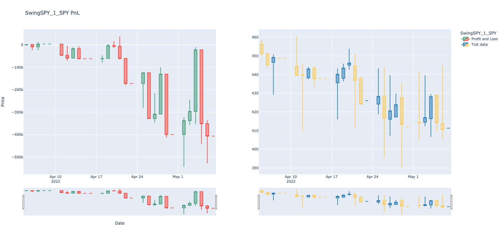
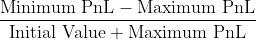

# High Frequency Trading Strategies with RCM Strategy Studio

**Group 1 IE 498 High Frequency Trading Final Report**

**Useful links**

- [Project repository](https://gitlab.engr.illinois.edu/ie598_high_frequency_trading_spring_2022/ie498_hft_spring_2022_group_01/group_01_project/-/tree/main/)
- [Readme](https://gitlab.engr.illinois.edu/ie598_high_frequency_trading_spring_2022/ie498_hft_spring_2022_group_01/group_01_project/-/blob/main/README.md)
- [Final Report](https://gitlab.engr.illinois.edu/ie598_high_frequency_trading_spring_2022/ie498_hft_spring_2022_group_01/group_01_project/-/tree/main/documentation/final_report.md)

[TOC]

## Team

**Yihong, Jian (Project Leader)**

- Yihong is a junior majoring in Computer Science at the University of Illinois at Urbana-Champaign. He will be graduating in Fall 2022 and interning at Meta Platform in summer 2022. He likes coding in C and C++ and has multiple project experiences such as implementing memory allocators, HTTP server/clients, and STL data structures. He is also experienced with machine learning, and developed vast parrallelization ML pipelines using Azure durint his research experience at National Center for Supercomputing Applications.

**Ruipeng (Ray), Han**

- Hello, I am a junior majoring in Math & Computer Science and Statistics at the University of Illinois at Urbana-Champaign. Though my study is wide and highly interdisciplinary, my primary career direction is still in the computer science industry. I will work for Foxconn USA this summer as a full-time software engineering intern, hoping to make connections with industry-leading engineers and learn to be a professional computer engineer. Besides the internship, I will also develop a web application project as my extracuriculum and strengthen my skills in frontend and backend programming. To sum off, I really enjoy programming in general (Python and C++), and machine learning and statistcial computing.
- Feel free to reach me at ruipeng2@illinois or my linkedin profile: linkedin.com/in/ruipenghan

**Tomoyoshi (Tommy), Kimura**

- Tommy is a current sophomore majoring in Computer Science in the Grainger Engineering Department at the University of Illinois at Urbana-Champaign. Although Tommy entered UIUC in 2020 Fall, he plans to graduate May 2023 for his Bachelor’s or graduate May 2024 with both a Bachelor’s degree and a degree in Master of Computer Science. Tommy is passionate about the application of Computer Science in interdisciplinary areas, which is reflected by his internship at National Center for Supercomputing Application using Computer Vision techniques for crucial agricultural studies. Tommy enjoys learning, and he is interested in Software engineering, System engineering, High Frequency Trading, Machine Learning, Front End Development, and Human Computer Interaction.

**Zihan, Zhou**

- Zihan is a current junior double majoring in Mathematics and Statistics and minoring in Computer Science. She is expected to graduate 2023 May. Zihan is passionate about the application of math and computer science in interdisciplinary domains and proficient in C++, python and R. She has been involved with IGL club working on Turan problem in graph theory. She has also developed interest and demonstrated skills in software development, big data managment and deep learning through multiple learning and project experience. Feel free to reach her at zihanz12@illinois.edu.


## Introduction

### Project Description

This is a semester-long project for the course IE498 – High Frequency Trading”, instructed by Professor [David Lariviere](https://davidl.web.illinois.edu/).

Our project aims to: 

- Develop alogrithmic trading strategies using nano-second accurate data, and
- Automate the process of downloading and parsing exchange source data, backtesting our algorithms on these data, and generating result figures and analysis.

We further break down our project into four sections: data retrival and parsing, strategy development, analysis, and automation.

1. Data Retrival and Parsing:

   The main market data sources for this project are Alpaca, NASDAQ, and IEX. We have developed parsing scripts for Alpaca and NASDAQ TotalView-ITCH 5.0

2. Strategy Development:

   We use Strategy Studio as the baseground to develop and backtest trading strategies. Strategy Studio is a proprietary software from RCM used for trading strategy developement and testing. Inside Strategy Studio, we create new trading strategies by implementing its interface (for example, inheirting the <code>Strategy </code> class). Then, we backtest our strategy in Strategy Studio using the data from the Data Retrival and Parsing section. The backtesting process will create three file (orders, fills, and profit-and-loss) which we can use to evaluate the strategy's performance.

   We implemented four different trading strategies: Buy-Last-Sell-First (BLSF), Swing, Mean-Reversion, and Arbitrage strategy. Details on strategies are in the Strategy Implementation section below.

3. Analysis:

   For the analysis part, we implemented interpretation and visualization script for SS backtesting output. In addition, we also packaged vagrant boxes for automated backtesting and set up GitLab CI/CD for code quality assurance.

4. Automation

   To make the project coherent and user-friendly, we have automate the entire process of the three sections above.

   Since the project contains multiple components and the pipeline is lenghty, we developed an automated script that will set up a virtual machine, download data, run backtesting, and generate visualization output.

### Technologies

#### Programming Languages
- Bash
  - A scripting language that allow users to chain series of commands and feed into computer
  - We write bash scripts for automation works.
- C/C++
  - Strategy Studio provides the interface entirely in C++ and allow us to implement various strategies in C++. 
  - We have also used C to write our Nasdaq data parser.
- Python 3.7.11
  - We used Python for several tasks dealing with data. We have implemented the Alpaca data parser with Python to download data from the Alpaca API and convert them into valid format for Strategy Studio Tick Readers. Alpaca API provides very useful Python package, and this is the primary reason we chose Python for this task.
  - Our IEX and NASDAQ TotalView-ITCH 5.0 data parsers are also implemented in Python. 
  - Python is also the major language for result analysis and visualization. We chose Python because there is a very powerful Visualization for financial market data called Plotly. 


#### Softwares

- Strategy Studio
  - We are grateful that **RCM** has sponsored us to give us free access to Strategy Studio for implementing and backtesting our strategies with the market data. 

#### Pipeline Frameworks

- Gitlab: We use Gitlab for version control and managing and tracking the changes to the project.
  - CI/CD: GitLab provides a package called GitLab runner that will trigger whenever we make changes to code repository
- Azure Virtual Machine
  - We used an Azure VM to host the gitlab runner
- Virtual Box/Vagrant
  - Virtualbox is a software that is used to create virtual machines
  - Vagrant can use virtualbox to launch standardrized VMs to keep consistency in each run of our project.
  - We used vagrant and virtualbox to set up the environment that runs our project.
  - Our vagrant box contained Software Studio and necessary enviroment. It derived from Prof's Fin566 box.

#### Packages

- Strategy Studios Includes

  Strategy Studios contains libraries defined in its software for developing strategies. Please see the stratege studio specifications for detailed documentaions on libraries and interfaces.

- Analysis packages

  ```bash
  plotly
  numpy
  pandas
  alpaca_trade_api
  kaleido
  ```

- Pipeline packages

  ```bash
  pylint
  cpplint
  ```

## Components

- This is a simple block diagram of our project. Everything is automated, meaning that with only one command, the three components start sequentially and generate the analyzed output for our chosen strategy over the chosen time period, 


### Repository Layout

```bash
group_01_project
├── analysis 
	└── ...
	├── compare_strategy.py
	├── main.py
	└── strategy_analysis.py
│
├── meeting_log 
│	├── ...
│
├── parser
	├── alpaca_parser
		├── ...
	├── nasdaq_parser
		├── ...
	├── iex_pareser
		├── ...
	└── download_from_alpaca.sh
│
├── strategy
	├── ArbStrategy
		├── ...
	├── BLSFStrategy
		├── ...
	├── MeanReversionStrategy
		├── ...
	├── SwingStrategy
		├── ...
	└── compile_and_backtest.sh
│
├── .gitlab-ci.yml
├── IE 498 Group 1 Project Proposal.md
├── README.md
├── Vagrantfile
├── go.sh
├── requirements.txt
```


## Instructions for Usage:

To run our compiled demo, follow these steps:
1. Download and install virtual box and vagrant
2. Clone our repo:
```bash
> git clone https://gitlab.engr.illinois.edu/ie598_high_frequency_trading_spring_2022/ie498_hft_spring_2022_group_01/group_01_project.git
> cd group_01_project
```
3. Create a folder called dependencies. You should add three files to it: 1. our [vagrant box](https://uofi.box.com/s/wlyq6b23k41dbw1bz7sfff631osp1049); 2. your StrategyStudio license; 3. Your strategy studio cmd options.
```bash
├── dependencies 
	├── IE498hftGroup1VM.box
	├── lincense.txt
	└── cmd_config.txt
```
4. obtain API key and secret from alpaca and update ```parser/download_from_alpaca.sh```
5. Hit it
```bash
> ./go.sh
```

The <code>./go.sh</code> will: 1. Download and parse the source data from Alpaca 2. Run backtestings on these data using the strategies, and 3. Generate analysis through visualizations.

Below are detailed instructions for using specific component (like parsers) of our project:

### DevOps

#### CI/CD

To ensure the codes are readable and functions properly, we set up an automatic GitLab CI/CD pipeline that runs whenever a pull request to main is opened. The runner rests on Azure VM and runs code linting/compiling. Python codes are checked against PEP8 standard and C/C++ code are checked against Google style. We also used strict compiling flags ```-Werror -Wextra -Wall``` to detect errors during compile time.

#### Vagrant

We repackaged Prof's FIN566 VM to include a built in Python 3.7 that provides access to additional dependencies requiring Python > 3.6. We also included automatic setup and job running script in the Vagrant file, so all the tasks can be done with one click.

### Data parsers

#### Data Sources

##### IEX

We directly imported the Professor's IEX downloader/parser as a submodule of our project so we can directly use it to download DEEP and TRADE data from IEX exchange that is ready to be feed into Strategy Studio for strategy development and backtesting. The link to Professor's IEX downloader/parser is [here](https://gitlab.engr.illinois.edu/shared_code/iexdownloaderparser). Details on directions of using the IEX downloader/parser can be found on the README.md under the project root directory.

```bash
parser
└── iex_parser
	├── src
	    ├── download_iex_pcaps.py
	    ├── parse_compress_iex_pcaps.py
    	├── parse_iex_caps.py
    	├── stockbook.py
    ├── README.md
    ├── download.sh
    ├── parse_all.sh
    
```

###### IEX Usage

1. Direct to the IexDownloaderParser directory `cd parser/IexDownloaderParser`and run <code>./download.sh</code> to download the source IEX deep data (.gz format). To retrieve data in a specific range of dates, open and edit the download.sh, only modifies the start-date and end-date arguments:

   ```bash
   python3 src/download_iex_pcaps.py --start-date 2021-11-15 --end-date 2021-11-16 --download-dir data/iex_downloads
   ```

   Note that git-submodules need to be pulled separately, detailed instruction for pulling git-submodule can be found [here](https://stackoverflow.com/questions/1030169/easy-way-to-pull-latest-of-all-git-submodules)

2. Check that the downloaded raw IEX DEEP dat files should be stored at `iexdownloaderparsers/data/iex_downlaods/DEEP`

3. Run `./parse_all.sh` to parse IEX deep data. Result will be stored under `iexdownloaderparsers/data/text_tick_data` with the foramt `tick_SYMBOL_YYYYMMDD.txt.gz`.  

   To specify the company symbols, edit the `--symbols` argument in `parse_all.sh`. The default is SPY only. You can add more companys:

   ```bash
   gunzip -d -c $pcap | tcpdump -r - -w - -s 0 | $PYTHON_INTERP src/parse_iex_pcap.py /dev/stdin --symbols SPY,APPL,GOOG,QQQ --trade-date $pcap_date --output-deep-books-too
   ```

4. The parsed data is in `.gz` format. We want to extract it and save it to a `.txt` file which can be feed into Strategy Studio. Run the following command under `iexdownloaderparsers/data/text_tick_data`  ***(please change your symbol and dates accordingly)***:

   ```bash
   gunzip -d -c tick_SPY_20171218.txt.gz | awk -F',' '$4 == "P" {print $0}' > tick_SPY_20171218.txt
   ```

   This command extracts the data and rows where the fourth column is "P", which corresponds to the format of "Depth Update By Price (OrderBook data)" in Strategy Studio. 

   If instead you want to retrive only the trade data, simply change "P" to "T" in the above command, which is following:

   ```bash
   gunzip -d -c tick_SPY_20171218.txt.gz | awk -F',' '$4 == "T" {print $0}' > tick_SPY_20171218.txt
   ```

5. The `tick_SPY_20171218.txt` (*or your custom data file*) is ready to feed in SS.

##### NASDAQ

Our NASDAQ parser (specifically, parser for NASDAQ TotalView-ITCH 5.0) is implemented in C.
We have implemented the parser according to the rules and requirements of NASDAQ TotalView-ITCH 5.0 [speicifcation](https://www.nasdaqtrader.com/content/technicalsupport/specifications/dataproducts/NQTVITCHspecification.pdf); specifically, we used we use the bswap macros to do the conversion from binary/raw data to texts.

Performance: The time to parse a 3G gz raw file is roughly two minutes.

Details on directions of using the NASDAQ can be found on the README.md under the project root directory.

```bash
parser
└── nasdaq_parser
    ├── makefile
    ├── nasdaq_itch_parser.c
    
```

###### NASDAQ Usage

1. Direct to the `nasdaq_parser` directory (`cd parser/nasdaq_parser`) in where the makefile is located, and run <code>make</code>.
   This should generate an executable of the parser named `nasdaq_parser`.

2. Run the nasdaq_parser with the following arguments:

   ```bash
   ./nasdaq_parser [input_file_path] [output_folder_path] [Message type = T]
   ```

   Please notice that current Nasdaq parser can only parse trade data, so the last argument should be set to T.

3. The parsed trade message will be outputed to the specified directory in the format of csv. These files are ready to be used by Strategy Studio for backtesting.

##### Alpaca

Alpaca market data API provides historical data from all US exchanges which account for 100% market volume. 

Alpaca parser is implemented in python, with two utitlity endpoints consists of `get_trade` and `get_quote`.

Alpaca parser is built with the help of sdk provided by alpaca [specification](https://pypi.org/project/alpaca-trade-api/) and [instruction](https://alpaca.markets/docs/market-data/)
In our project, we are using `trade` data to built order book in strategy_studio, since alpaca quote data is initialized to be NBBO which involved two trade centers, but strategy_studio only accept quote data from one trade center.

```bash
parser
├── alpaca_parser
	├── alpaca_parser.py
```

###### Alpaca Usage

- Alpaca data parser requires dependency of `alpaca-trade-api` library.

- Specifically, we have provided a simple bash file for automatic parsing. Inside `bash file`. After specifing variable in `python3.7 /home/vagrant/Desktop/alpaca_parser.py [tick_name] [yyyymmdd] [yyyymmdd] --mode=[T] --output='/home/vagrant/Desktop/strategy_studio/backtesting/text_tick_data'` it would download `tick_name` market data start form `startdate` to `enddate` by calling aplaca historical data api.

  ```bash
  ./download_from_alpaca.sh
  ```
  
- Altenatively, running with `-mode=Q` would download accodingly `quote` data. 


#### Strategy Studio Data Feeds

Strategy Studio offers a great tool for data feed – text tick reader. This allows Strategy Studio to facilitates automated strategy regression testing against pre-canned data scenarios involving common tick types. In this project, we will store these pre-canned data with the specifed naming convention `tick_SYMBOL_YYYYMMDD.txt`. The text reader supports various event types and fields: 

1. **Trades**
2. **Quotes (Best Bid Offer)**
3. Depth Update By Order (OrderBook data)
4. Depth Update By Price (OrderBook data)
5. Order Book Reset
6. Imbalance

For this project, we would mainly focus on two specfic events: **Trades** and **Quotes (BBO)**. 

##### Trades

- Trade data can reveal general trends in world trade, and Strategy Studio provide registration for Trades (and quotes), and we could use the trade data to feed our strategy to test the performance. To sue Trade data, we often implement the function `onTrade` which is called everytime the tick-reader has detected a trade tick. Then, we would use the passed in TradeEventMessage to update our variables, and then decide whether or not we would like to send an order to buy or sell. 

##### Quotes (BBO)

- Quotes, BBO, or Best Bid & Offer provides us the best bid/ask price in the current market. Unlike Trade data, for which the function `onTrade` is specifically called, `onQuote` does not behave the same and is only called when the best new data is updated. In this case, we use the function `onBar` to reach our goal. For strategy studio, on bar allow us to access the tick information within a short amount of period (bar). Everytime, we could access these information to make a trade. 

#### Example CSV Output


------

### Strategy Implementation and Results

#### Buy Last Sell First Strategy

##### Description

- This strategy is an introductory strategy that we implemented to understand the Strategy Studio interface. The basic pipeline is that we are buying at the end of the day, right before the market closes. Then, we would sell when the market opens. This was recommended by the Professor of the course to start off with, and we have modified a few aspects to make the algorithm more robust to extreme market cases. 
- The central belief of the algorithm is that the market price would raise during the closure of the market at night, and therefore buying before the closure and selling right after could theoretically give us a profit based on this belieft. However, with the increasing instability of the market, we might not see the stated pattern as the price of the market could dramatically fall with surprising news negatively affecting our world. Therefore, with only a minor modification to the original algorithm, we decided to add a few variables to keep track of the previous bought price in order for us to compare with the new price. If the new price to sell is lower than the price we bought it, we would keep it until the price is higher. This of course induce the possibility of long term stock holding, however, it would improve the confidence for us to lose less money when the market is in extremely bad conditions. 
- We would also keep tracks of the number of stocks we own. Everytime we sell, we would sell the entire amont of stocks we have bought. And when we buy, we would just buy the maximum number of size from the trade message. 
- Buy Last Sell First Strategy utilizes the Time Type variable that is passed in through the `TradeEventMessage` or `BarEventMessage`. Since the time of the market is the most important metric of this algorithm, either type of message or data feed would be fine to work with. 

##### Visual Results

###### Real Time Analysis

- SPY

  

- APPLE (AAPL)
  

###### Profit and Loss with respect to the market data

- SPY 
  
- APPLE (AAPL)
  

###### Measurement Table


##### Analysis

- From the measurement table, we could see that the BLSF trading algorithm actually performs well in playing safe for a profit. We have picked the period from April 5th to May 6th, when the traders have been in fear due to the war and the shortage in many supplies. Both SPY and AAPL fell roughly around 10 percent. However, our trading algorithm still managed to give us a positive return. It is definitely not the most profitable algorithm, but it is a safe algorithm to run to reduce the cost of gigantic loss. We could see from the measurment table that the maiximum profit and loss outweighs the minimum profit and loss for both SPY and Apple, which shows the generality it has over different symbols. 

#### Mean Reversion Strategy

##### Description

- The mean reversion trading strategy involves betting that prices will revert back towards the mean or average (of historical trades of size n, where n is tunable hyperparameter). Markets are forever moving in and out of phases of mean reversion and momentum. Therefore it’s possible to develop strategies for both types of market. A simplistic example of a mean reversion strategy is to buy a stock after it has had a large fall in price. When a stock has seen a big drop, there’s usually a good chance that it will bounce back to a more normal level.

- In our project, due to limitations on hardware, we can't take long-trend mean value that reflects the true underlying value of an equity (usually we need months and years of historical data, which we can't possibly store and process). Thus, we instead calculate the mean value of a simple, fixed size trades to "mock" the value of the equity. In our case, that size is a hyperparamter and we have set it to 1000 (i.e calculating the mean of last 1000 trades). Since 1000 trades is an extremely short period considered dozens of trades may occur within the same millisecond, our mean-reversion strategy has a MUCH higher trading-frequency than other strategies, which introducues a large memory consumption that crashed our VMs. It is too expensive to run backtest on multiple days of historical data. As a result, we only backtested this algorithm for two days.

- Mean-Reversion Implementation: We used a class <code>Analytics::RollingWindow</code> from the Strategy Studio's library to calcualte the mean price of a tick. This class behaviors just like a vector of integers, meanwhile providing the current statistics of these integers, such as mean, standard deviation, and even z-score. Thre is an window_size parameter to define an upperl limit on number of integers to store in the window, which is currently 1000. In our implementation, we used a std::map to map each tick symbol to its own means (an <code>Analytics::RollingWindow</code> object) so that each equity can have its own reference/standard to compare with. For each trade message read in, we will push the current equity's price to its corresponding window, if there is an overflow, then the integer oldest by time will be dropped so new space is released.

  Then, for each trade message, the algorithm sells the equity when the current price goes beyond the mean at a particular threshold and buys when the current price goes below the mean under a certain threshold. 

##### Result

###### Real Time Analysis

- SPY

  

- AAPL

  

###### Profit and Loss with respect to the market data

- SPY

  

- AAPL

  

###### Measurement Table

- SPY

  

- AAPL

  

##### Analysis

- We could see from both AAPL and SPY that the mean reversion takes great advantage of the price difference between the on-going price and the mean. The two-day return rate is about 90% for SPY and 50% for apple. Though the result is rewarding at the end, the pnl is highly volatile: notice that both SPY and AAPL's pnl crashed below 2 million USD. This volatility partly attributes to the constant trade actions performed by the algorithm. The mean-reversions will trigger a trade once it detects a deviation of price from its historical mean: buy if lower than mean and sell if higher than mean, all based on the assumption/theory that **asset price volatility and historical returns eventually will revert to the long-run mean or average level of the entire dataset.**  However, true stock market does not always follow that rule. Once the overall trend suddenly goes down, then the algoirthm will buy; if the equity never returns to its previous "avg" price, then the buy action can potentially lose sigificantly. This explains why the pnl fluctates greatly.

- In addition, our mean-reversion only calcuates the mean of previous 1000 traded prices, not the mean of the long-term traded price usaully ranged a couple months or even years. If we have access to more computing power, we can signficantly improve the algorithm by finding the long-term mean price.

#### Signal Trending Strategy

##### Description

- This strategy is a derivative of the Momentum strategy. However, unlike a normal momentum strategy, this strategy will read data from two market ticks at once, using one tick as a signal tick and the other as a trade tick.
Given that an ETF represents the value of a set of underlying assets, movements in the eft will represent, to varying degrees, movements in the value of the assets. The S&P 500 (SPY), as an EFT, is one of the most liquid and most quoted market indices. So we will use the S&P 500(SPY) as the signal tick. Also, as the number of large market capitalisation has a greater impact on the index value, I will choose the market data of some of the higher market capitalisation companies as the trade tick, such as Apple (AAPL). 

- The strategy will read the trade data of two makerticks together in increasing time order (down to the nano-second) and determine the trend of the signal tick over a certain period of time to decide whether to buy, sell or hold the trade tick in the period immediately afterwards. In order to avoid reading the next period of data before the end of a SELL OR BUY trade, the strategy is written using a "state" variable to indicate six different trade states: start, after sent order, buying, holding, selling, and after selling.

- The strategy is written using the onTrade api and sendorder api from the strategy studio. The logic for the strategy to determine trending is also written into the onTrade function. If the current signal tick (SPY) trade value is greater than the last past 3 trade values by upthreshhold, an uptrend is considered to exist and a buy action is taken on the trade tick (AAPL). If the current signal tick(SPY) is trading at a value less than the last past 3 trade value by downthreshold, it is considered to be in a downtrend and a sell action is taken on the trade tick(AAPL). The final strategy also implements a stop-loss method to avoid excessive losses, the effect of this optimisation strategy is described in the analysis part.

##### Visual Results

###### Real Time Analysis

-SPY | AAPL
 

###### Measurement Table

-SPY | AAPL
 

##### Analysis

We have analysed the market data for April 5, 2022 and selected SPY as the signal tick and AAPL as the trade tick. The volatility of the pnl shows that the two market ticks are less correlated and less volatile at the beginning of the trade, with a stable loss of around $3,500. As the trading time was extended, the pnl became more volatile, but the pnl showed a profitable value. In general, the trading strategy made many trades, but did not result in large losses, which suggests that the trend of the spy is to some extent reflective of the trade tick buying and selling strategy. However, it is important to realise that in the real market, the trend of the spy is influenced by many other factors and cannot be used to fully reflect the trend of one of the stocks, as it takes into account the market capitalisation of many companies. At the same time, SPY is more often used for the designation of long term strategies and if we were able to run more days of market data, we would be able to see more correlations and more efficient trading.

At the same time, we implemented stop-loss logic to prevent large losses, and in terms of the final pnl, this trick helped us to reduce our one-day retrun from -130,00 to -2,000.

#### Swing Strategy

##### Description

- This was a strategy described on CMC Market website. This strategy utilizes a structure of Swing to make decisions to trade. We could draw a swing in the real world as an analogy. When we are swinging, there is often a high point, and this would be the highest point we could reach. After this point, the swing would go back down to its lowest. Once it reaches its lowest point, the swing would then go back up to another point that is about the same as the previous high point, and so on. During this process, the swing could potentially go beyond the previous high points, with some extra mystery force, and this higher point could drive us to many different points. We use this analogy to describe the market, where we assume that the market price would fall after we reach the highest point, and vice versa. 
- To decide whether the market has reached its highest point, we are using Momentum to determine the overall trend of the recent market price. If the overall trend aligns with our previous trend, we know that we are still rising. However, if the momentum trend is completely different from our previous trend, we know that there is a big corner for recent trades, and we would then buy/sell accordingly to indicate a swing point. The swing points are updated by the local maximum and local minimum the interval has obtained to make sure that the Swing interval is changing based on the market flow to maintain the consistency. 

##### Results

###### Real Time Analysis

- SPY
  
- APPLE (APPL)
  

###### Profit and Loss with respect to the market data

- SPY
  
- APPLE (APPL)
  

###### Measurement Table


##### Analysis 

We have run the strategy for two different tickers, SPY and Apple from April 5th to May 6th. We use the analysis component we wrote to calculate the measurement and generate visualization. We could see that the Swing Strategy has an extremely poor result compared to the other strategies we have implemented. However, we can see that even though the Market was down by roughly ten percent, our strategy was able to lose 4 percent and less, as shown in the cumulative return section of the measurement table. Nevertheless, we have also conducted another experiement on another date, when the market is in a stable rising state. In this case, we had a very high positive Profit and Loss. TThis reflects on the fact that our Swing Algorithm would take the bold move, unlike some other strategies like BLSF, and it would behave extremely well if the move is successful, and lose very badly if the market has gone down. There are, though, some parameters that we would like to continue tuning for a better performance. Such as the momentum calculation for the general trend, and an expectation for the Swings that is more reasonble based on the existing trends. 

------

### Interpretation & Visualization

#### Interrpetation & Visualization Layout

```
strategy
	├── compare_strategy.py
	├── main.py
	├── strategy_analysis.py
```

#### Interpretation

- There are various metrics that we would like to evaluate on our result. Strategy Studio outputs three files: fills, orders, and PnL (Profit and Loss). For analysis, we would mainly focus on PnL since the net loss is what we care about the most as traders. 

- The PnL file generated is a `.csv` file with three columns: Strategy name, Time, and Cumulative PnL. For interpretation, we would analyze the PnL based on several metrics. 

  - Maximum Profit and Loss

    

  - Minimum Profit and Loss

    

  - Net Profit and Loss

    

  - Cumulative Returns

    

  - Sharpe Ratio

    

  - Max Drowndown

    

#### Visualization

- For visualization, we are using the Python package `plotly` to generate various meaningful graphs for evaluation. `plotly` offers powerful interactive figures for users to modify directly. Just like a few of the examples in the previous sections, we could see that there are various types like line, bar, and table like figures that simulates stock market graphs in real finance applications like Yahoo Finance. 
- Plotly is extremely power for interactive visualization. For example, we could see that we could decide which trace of the graph we would like to see, and hide the other one by simply clicking the legend. 

##### Implementation

There are mainly two classes: `StrategyAnalysis` and `CompareStrategy` . We also have a `main.py` file for automation, that is, our DevOps could directly run this program that generates the newest export files, and our program would look for this latest files and execute on these. Then, it would store these files in a new directory for us to access. Beside automation, our implementation also allows interactive modes that give the user control over the exact strategy they would like to compare. User could add as many as they want by Name, Id, and Ticks. At the end of the interactive mode, the program would automatically run the comparison class and generates outputs. 

###### Strategy Analysis

- This class represents a Strategy object. This type of object is initialized with the three files generated from the Strategy Studio and it would use Pandas Dataframe to store each fill, order, and PnL. For each strategy, we also add the corresponding Tick data into it so we could evaluate our strategy with the market data to understand the reasoning behind the rise and the fall of each. 
- Examples could be found in previous sections. 

###### Compare Strategy

- The strategy acts like a container that holds all the Strategy object we mentioned earlier. In this class, we could evaluate the performance of each strategy with each other, and output graph and table for traders to analyze each strategy. The measurement table for Swing between Apple and SPY could be an example, and another example is the evaluation of BLSF Strategy and Swing Strategy on SPY market data. 
  

##### Interpretation & Visualization Usage

- Direct to `analysis` directory (`cd ./analysis`)
- Simply run `python3 main.py` would run visualization by using the latest three files (Fill, Order, and PnL). This will generate figures and store in `./figs/` directory. 
- There is also an interactive version by runing `python3 main.py -i` and follows the promot.
  - Interactive mode would ask you to add strategy by entering the 
    - `Name` of the strategy
    - `ID` of the strategy output if the strategy is ran multiple times
    - `Ticks` of the strategy, or the symbol, for example:`SPY` 
  - When we enter no for adding strategy, the interactive mode would also outputs the **measurement table** with each strategy statistics as a column

## Conclusion / Reflections

### Yihong, Jian (Project Leader)

1. **What did you specifically do individually for this project?**
  
    - I implemented our DevOps pipeline from scratch: organize project file structures, set up Azure VM, connect VM to GitLab using GitLab runner, write CI/CD jobs that checks for code sanity. 
    - I wrote vagrant files and bash script that will automatically launch our project components
    - I re-wrote the trade part of our Alpaca parser
    - I upgraded the Makefile of our strategies to include more error checks
    - I started our ArbStartegy
    - I performed code reviews

2. **What did you learn as a result of doing your project?**

    - I learned how a high frequency trading strategy development process is like in this project. Specifically, I had a deeper understanding on how collecting accurate and detailed trading data feed would affect the results and performance of algorithmic trading. I also understood how are orders triggered and executed in the high frequency trading algorithms.
    - Another aspect I learned is the difficulties of keeping consistant development environment. Even if the vagrant VM is distributed, there could be issues in line endings -- CRLF vs LF that would completely ruin the pipeline
    - The third aspect that I learned is the difficulty of reaching concensus among peers. Even though we all had basic understanding of the project, it took us time to know what exactly others are doing and others are struggling on.

3. **If you had a time machine and could go back to the beginning, what would you have done differently?**
    - I would set up a stricter and more detailed timeline for each member and entire group. In that way, we could have a better time management and progress update instead of piling everything to the end.
    - Another thing I would do is chasing Prof David for the rubric before final week.
4. **If you were to continue working on this project, what would you continue to do to improve it, how, and why?**
    - We would continue to polish our data parsing scripts. We were able to use trade data from all sources successfully. However, we could not get SIP quote data working in Strategy Studio. We could continue the project to resolve this issue.
    - Another aspect that we could improve is standardrized testing. We were hoping to launch Vagrant from our CI/CD runner and profile strategy performance in every update. However, we weren't able to set up this pipeline since it requires nested virtualization or out-of-update packages.
5. **What advice do you offer to future students taking this course and working on their semester long project. Providing detailed thoughtful advice to future students will be weighed heavily in evaluating your responses.**
    - Don't think that there are 1 more week to accomplish milestone, you could encounter more issues than you thought
    - Don't be over ambitious. Some trivial tasks might take much longer due to communication/niche errors that are hard to debug.

### Ruipeng (Ray), Han

1. **What did you specifically do individually for this project?**

   I have accomplished two main tasks for this project individually: the NASDAQ TotalView-ITCH 5.0 data parser and the Mean-Reversion Strategy. 

   I implemented the NASDAQ parser in C. NASDAQ TotalView-ITCH 5.0 has many message types, for our project, which uses only traded tick data so far, I only implemented the program to parse trade message from Nasdaq. I followed the binary-to-text conversion rules spcified by the Nasdaq guides and parse the raw binary file to CSV and txt, which are ready to be passed into the Strategy Studio for backtesting. To make the parser user friendly, I also included a makefile to compile the program so the user will only need to run make and run the executable to use the parser.

   The Mean-Reversion Strategy is one of the three main strategies (considering BLSF as a simple, intro strategy) we developed. I developed this strategy on my own based on some research online. The strategy, like others, inherits the <code>Strategy</code> class and I used my own data structures to implement the core logic of mean-reversion. I have backtested the strategy many times and tuned its parameters aiming to improve its performance.

   Some relatively smaller individual tasks I did: Imported and used Professor's IEX downlaoder/parser and included directions on using the parser. Included Readme and any documentations for instructions on using parsers and mean-reversion strategy.

2. **What did you learn as a result of doing your project?**

   From developing the Nasdaq parser, I learned how to write a parser for raw/binary data in general: basically reading and understadning what fields it means and which bit means what at what index. I also learned how to write the parsed results to a txt files. 

   Developing the mean-reversion strategy tought me a lot, both technically and financially. First, I learned the basic fundamentals of mean-reversion strategy and its benefits and caveats in real-world applications.  There are many temrs and formulas I learned during researching the related topics on mean-reversions, such as the SMA (Simple-Moving Average), Raff regressions, RSI indicators, etc. Secondly, I learned how to use Strategy Studio to develop functioning (and profitable, at least on somedays) strategies. During the development process, I did tons of parameters tuning to fit my algorithm to different equities, so I have definitely grasped the importance and practice of tuning and testings. 

   Lastly, I have learned a lot using git and gitlab as a tool to better track and manage changes to code in our project. I learned many useful commands such as checking out remote branches, switching branches, merging, creating pull/merge requests, etc. These knwoledge is extremely useful becuase git is essential to programmers.

3. **If you had a time machine and could go back to the beginning, what would you have done differently?**

   First, I would definitely began the strategy development earlier. I did poorly on time distribution for this project, that I delayed till the last one week to develop the strategy. I found out that the strategy development is very fun and customizable based on my own ideas on trading, so more time doing this part will definitely result a better algorithm.

   Another thing I would have done differently is to use working Nasdaq parsers from the Internet instead of developing it on my own, though I learned a lot during the way. I did not know we could use outside parsers for our project until after the midterm demo, so I guess next time I shouldn't wasting two weeks on parser if I can find one from others.

4. **If you were to continue working on this project, what would you continue to do to improve it, how, and why?**

   I will continue working on the mean-reversion strategy, because the current one is still overly simplified compared to the actual mean-reversion strategy. I would like to know how my strategy perform on markets if I can get it to work the way it intends to do. As of right now, my way of finding the "mean" is by calculating the past 1000 trades on the equity, instead of 30-days or 90-days moving average which is standard in industry. Also, calculating 30-days and 90-days moving average is not possible because we don't have access to enough computing power and hard disks to store these data.

5. **What advice do you offer to future students taking this course and working on their semester long project. Providing detailed thoughtful advice to future students will be weighed heavily in evaluating your responses.**

   1. Never be shy to ask the professor. Professor Larivietre replies very quickly 90% of the time so when you have questions just ask. Besides, professor is chill and often posting funny stuffs on Discord so don't be shy.
   2. Don't leave todos util the last three weeks. I did this for this project and it was pretty frustrating, because it was hard to focus on preparing for final exams as well as doing the project. Plus, when I was pressured by the due date, all I want to prioirtize is on finishing the project with bare minimum, instead of improving it to its best, which obiviouly my loss because I did not get to learn deeper with my topic.

### Zihan, Zhou

1. **What did you specifically do individually for this project?**

   In this project, I did two main things.
   Firstly, I was responsible for the alpaca parser，and also provide my understanding and advice for writing other parsers. I researched the api for the alpaca market data and built a working first version of the parser. After Jian wrote the different forms of the get_trade section, I finished writing the corresponding get_quote section. I also looked at the data input formats that could be used in the strategy and finalised the parser. I also tested several use cases of the Alpaca trading api output and found that the NBBO data output from the Alpaca quote api could not be used in a strategy studio that accepted BBO quote data, which affected the way we ended up building the strategy. 

   Secondly, I completed a single signal trending strategy based on research and understanding and achieved profitability at multiple times of the day. During this phase, I independently explored the various trading interfaces and classes in Strategy Studio and identified the equations required to trade the strategy. I spent a lot of time testing and debugging as I completed the strategies, and in the process deepened my understanding of the logic of how Strategy Studio works. I refined the trading logic and the stop-loss method to improve the pnl.

   Finally, I collaborated on the documentation and PowerPoint writing.

2. **What did you learn as a result of doing your project?**

   I learnt two main things in the process of writing the parser. The first point is to focus on error handling during the writing of the parser, because we have to take into account the situation where the user is unfamiliar with the interface and mess up, and a good error handling can improve the user's efficiency and provide them with the results they want in a faster way. Secondly, as fetching data is relatively time consuming, the coder writing the parser should include some edge cases in advance, for example, there is no market data on Saturdays and Sundays, which should not affect the user's ability to specify a start date and an end date for fetching data; and the time difference between the exchange and UTC should be taken into account.

   In the process of writing a trading strategy, I learnt about the building a trading strategy and the associated test and debug techniques. Firstly, I realised that understanding the interface and class of the trading software (Strategy Studio) is the most crucial step, which solves some basic problems such as what equations to call or what type of variables to set. At the same time, I learned how to improve the pnl, such as parameter tuning and stop-loss, and was able to effectively debug programs in conjunction with order/fill output. 

   Finally, I learned some scripting skills related to automatuion and vm setting, which I think I have rarely covered in other projects.
    
3. **If you had a time machine and could go back to the beginning, what would you have done differently?**

   First of all, I think I would have started strategy construction earlier, at the end, our team's time was taken up by various final exams. And the strategy construction itself, which ended up being compressed in time, was a very interesting process and could be used for various ideas.

   Secondly, I will strengthen the communication with the team members, especially in the construction of some pipelines. At the end, the trading strategy I have implemented requires two market tick inputs at once, which the back testing visualization does not take into account. I think adequate communication would have avoided this problem.

4. **If you were to continue working on this project, what would you continue to do to improve it, how, and why?**

   Firstly, I would spend more time on the single signal trending strategy and try out different EFT signals to predict their impact on the stock price of big tech companies. Also, I will optimize the determinants of trending. In the current strategy, what we do is to determine the trend by comparing the extreme value of every three past trades with the current trade price, and this can be optimized with some mathematical calculations, and I can find a better way to determine trending.

   Secondly, during my research on Alpaca, I realised that it can be used not only for backtesting, but also for real time data streaming, so if I have more time, I would like to use websockets to get real time market data, which will also be used for strategic efficiency test. 

   
5. **What advice do you offer to future students taking this course and working on their semester long project. Providing detailed thoughtful advice to future students will be weighed heavily in evaluating your responses.**

   The first advice I would give is that it is beneficial to set up a devop side available to team members as early as possible and to optimise the automation process as much as possible, this will optimise the efficiency of the collaboration afterwards as different members will be interacting with the project in different environments.

   The second recommendation I would like to make is that team members should exchange sufficient information based on applied knowledge in a field, i.e. everyone should share relevant information frequently and proactively, which will greatly improve the efficiency of the collaboration. More importantly, this will improve the team members' understanding of the project and identify possible errors earlier.

   The third piece of advice I would like to give is to ask a lot of questions; Professor Lariviere is usually very prompt in answering students' questions. If the whole team is spending too much time at one stage, it is important to find effective supervision. Also, if you are working independently on a particular part of the development, it is important to ask your teammates more questions, as you will all benefit from the process.

   The fourth suggestion I would like to make is that it is important to have a detailed and adjustable division of labour and that each team member should report on their part and progress within a time frame. This will facilitate the coordination of the project, and ensure that everyone gets the relevant help. Finally, start each phase of the project early in advance.

### Tomoyoshi (Tommy), Kimura

1. **What did you specifically do individually for this project?**

   For this project, the major tasks I was responsible for were Analysis & Visualization, Strategies Implementation, Documentations, and video recordings. The entire project has been splitted into different phases, and during the first phase, each of us worked on different parts, and I mainly developed the analysis program for the strategies. I was able to design and implement various objects with Python to achieve the goal, along with learning and applying powerful packages like Plotly to create good visualizations for our strategy analysis. In the last phases, I have used this program to generate various meaningful graphs for my peer and for the documentation. 

   During the second phase, I took over the responsibility to dive into the Strategy Studio examples to understand the interface of the class Strategy, and was the first one to try out implementing an introductory strategy recommended by the Professor (Buy Last Sell First). During this process, I had the opportunities to help my team to understand how the Strategy class interface works, and give them some guidance in helping them to start off on their strategy. I was also able to test the parser we developed in the earlier phase and pointed out potential possibilities for improvements. Beside BLSF, I also tried writing a different strategy, the Swing Strategy. I found this strategy through internet and learned from videos to implement it in Strategy Studio. 

   For documentation, I also worked on organizing readme file and the Final report for this project, including outlining the project structures for my peers to fill in and polishing the files according to Professor’s rubric.  

   Lastly, I have recorded the Demo video for project submission. 

2. **What did you learn as a result of doing your project?**

   I have learned a lot as a result of doing this project. And one thing that I am most grateful about is learning the DevOps pipeline for a better project flow. I was able to learn a lot from my teammates regarding better Git control through a strict pipeline checking for every commit. I feel like I am more comfortable using Git for any project and believe that this has benefited me for the future. Beside the general DevOps, I have also learned and firmed what I have learned in the class: Market Trading. From developing my own Trading Strategies over financial market, I feel like I now have a solid understanding in the microstructure of the market, including the data feed like Trade and Best Bid and Offer. Writing my own strategies also taught me many tricks that this industry has for making profits. This project definitely prepares me well for this area in many ways, and also excites me for the course **Algorithmic Market Microstructure** next semester. I have also practiced my skills in Object Programming and Data Visualization  through this project, and these would definitely be beneficial to my future. 

3. **If you had a time machine and could go back to the beginning, what would you have done differently?**

   One thing that I would have done differently is to make sure that I have done enough research and negotiate with team member enough to have a better understanding of the detail pipelines of the project. And I would definitely recommend conducting more tests for each sub-project. When I was generating graphs with my analysis program that I wrote in the earlier stages, I realized that I missed some small features and resulted in errors or generated some figures that were under the expectation. Because of this, I had to renegotiate with my team members and rewrite some parts of my program to fit into the automation pipeline as well as fixing the errors for generating the stategy figures. Other thing that I would have done differently is the work distribution during this semester. It was a bit rush near the end and things have only gotten busier with finals and other final projects. Therefore, distributing more heavy works to the first half of the semester would definately improve it. 

4. **If you were to continue working on this project, what would you continue to do to improve it, how, and why?**

   If I were to continue working on this project, I would continue working on writing better strategies and more meaningful visualizations. Although we have already implemented different strategies, there are definitely various cases that these strategies are prone to, and there are definitely different features we could implement to improve the performance of the strategy. The current strategy I have implemented takes bold moves and perform well with data that has oscillating behaviors. However, when the market data falls continuously, my strategy does not perform well and loses money, since our assumption is broken in this case. Due to the lack of time, I have yet been able to modify much to generate a satisfying output, but I would love to continue working on it for better performance. Beside this strategy, I feel like I could improve the analysis & visualization program further to reflect on possibilities for improvements of the strategies. The current program would only generate some statistical measurements and general PnL of the strategies with the tick data. However, if the program could show graphs that give feedbacks on how to improve the strategies, the process of writing better strategies will be more efficient and less time-consuming. 

5. **What advice do you offer to future students taking this course and working on their semester long project. Providing detailed thoughtful advice to future students will be weighed heavily in evaluating your responses.**

   The first advice I would give is to negotiate with the teammate well and develop a strong DevOps and project pipeline in the beginning of the semester long project. Having this strong pipeline allows a smoother workflow and improves the project efficiency in many ways. Generating these rules could assure the code quality as well as the project standard in many ways. My second advice would be make sure that the group has a very detailed and structured plan for their project. This would make sure that every team member can keep track of whether what they are doing fit into the project pipeline, and this would reduce lots of error and time-consuming debugging process near the end of the project. Lastly, I would recommend that never hesitate to ask questions to both your team members and the professor. Your peers could often give you new insights to the problems, and you could always learn something from them. Professor Lariviere is very informed in this industry, and he always reply fast and know answers to most of your questions. 


## Reference

1. https://www.cmcmarkets.com/en/trading-guides/trading-strategies
2. https://optionalpha.com/help/backtesting-results-summary
3. https://blog.quantinsti.com/backtesting/
4. https://blog.quantinsti.com/stock-market-data-analysis-python/
5. https://plotly.com/
6. https://www.nasdaqtrader.com/content/technicalsupport/specifications/dataproducts/NQTVITCHspecification.pdf

