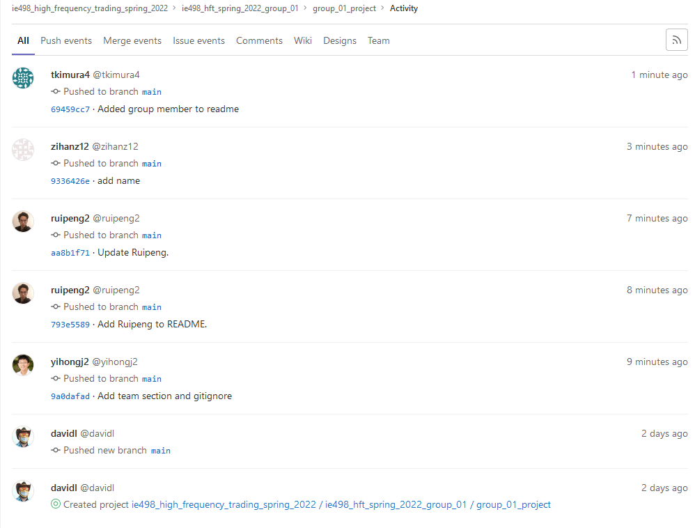

## 1. Captain

me (Yihong)

## 2. Git access screenshot

 

## 3. Ideas

1. Paper money trading algo

   Predict price on next tic based on past data (OHLC + some other indicators). We gonna approach this by first predicting the price (or movement) using time series analysis skills, and then develop algos to trade tickers.

   - Skillsets
     - Stochastic process?
     - Python
     - Some deep learning
     - Data processing
     - Crawler?
   - Testing
     - Back test on past market data
   - Some ideas
     - UI to adjust params?
     - Put it on live data

2. Correlation between NASDAQ && IEX?

   Performance Analysis of IEX and / or NASDAQ. This idea comes from the PDF. We need to invest more about it to give detailed plans

3. Some infra structure related project

   - A TCP engine
     - Written in C, kind of like CS438 MP2
   - 

